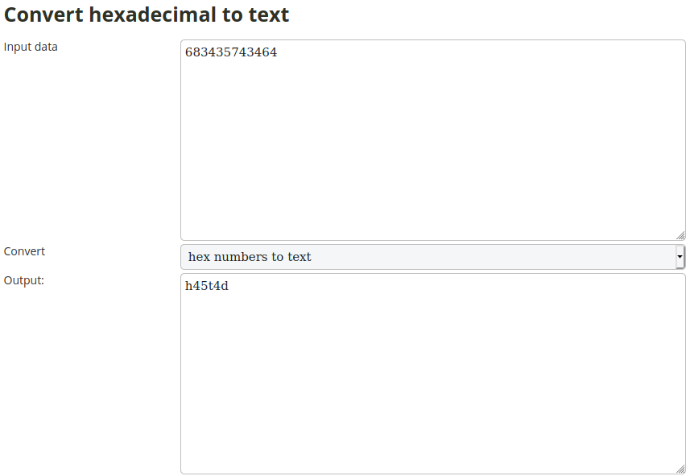

## Quick Math
The main idea finding the flag is decrypting the RSA exponentiation.

#### Step-1:
Given statement

```
Ben has encrypted a message with the same value of 'e' for 3 public moduli - 
n1 = 86812553978993 n2 = 81744303091421 n3 = 83695120256591 and got the cipher texts - 
c1 = 8875674977048 c2 = 70744354709710 c3 = 29146719498409. Find the original message.
```


#### Step-2:
This article is quite renowned: [https://www.johndcook.com/blog/2019/03/06/rsa-exponent-3/](https://www.johndcook.com/blog/2019/03/06/rsa-exponent-3/)


#### Step-3:
So, I wrote `exploit.py` script to get the flag.

```python
from sympy.ntheory.modular import crt

N = [86812553978993, 81744303091421, 83695120256591]
c = [8875674977048, 70744354709710, 29146719498409]
x = crt(N, c)[0]
print("Hex String:")
print(round(x ** (1. /3)))
```
After running the script by `python3 exploit.py`, I got a hex string.

#### Step-4:
I converted it online to ASCII [here](http://www.unit-conversion.info/texttools/hexadecimal/).



#### Step-5:
Finally the flag becomes:
`csictf{h45t4d}`