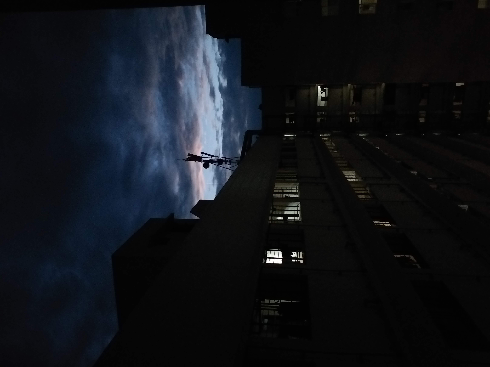

## Gradient Sky
The main idea finding the flag is using simple Steganography techniques.

#### Step-1:
After I downloaded `sky.jpg`, I tried simple `strings sky.jpg | grep {`



```
n"l`{
X#,{c#
<{{!g6
{}qv
R{Guv
9Cs{c=
f{_(
2;{PG<
oH{iy$
0{Tn
q{dv
{=Zw
=||^{r
75ub{
|AcV{
;?{O
`58{
M{>ww
ET{vz
{tL=['
r{;M
{z_|
Ezv{M
ef^{
{NxTy
'{w'=\W
;\&\{
yv{O
nyui{
{.,}
.{M.
h)+{8
={,^
L,QaQDX{
X{{V
fty{/
xr{4<
]{>{
x8]{
c&A{
={-^/
-iQuG-S{
6{)s
7{oi
w'u{
,:({
ly={=/.
{V<7,
qv{]:
z={m
v{M:v
/@j{
{Yowk
M{65
{]:uc
M[\{
yv{M:
f_UQ{
m{G/
W.q{
E{4;G-
{63(
][-z{
?f{F
<{\u
=+:{^
w={<=x
xVP{
Z8<{;
;}z{
?-{>
?9{6
Vy={>
o.{[
{~zru
{9E~
m?Oi{
.{]}
:zP{
zv{=:
 k-tb{
o{tl
{=3{
?p{{,
v{<k
6{[3
S{25
y{_f
DX}L{
Y%O{
sz/{S
{]Sv
m6{=
v[M{;
{Vf?
%zv{lLPg
x'{O
csictf{j0ker_w4snt_happy}
```
Voila! There we have our flag.

#### Step-2:
Finally the flag becomes:
`csictf{j0ker_w4snt_happy}`