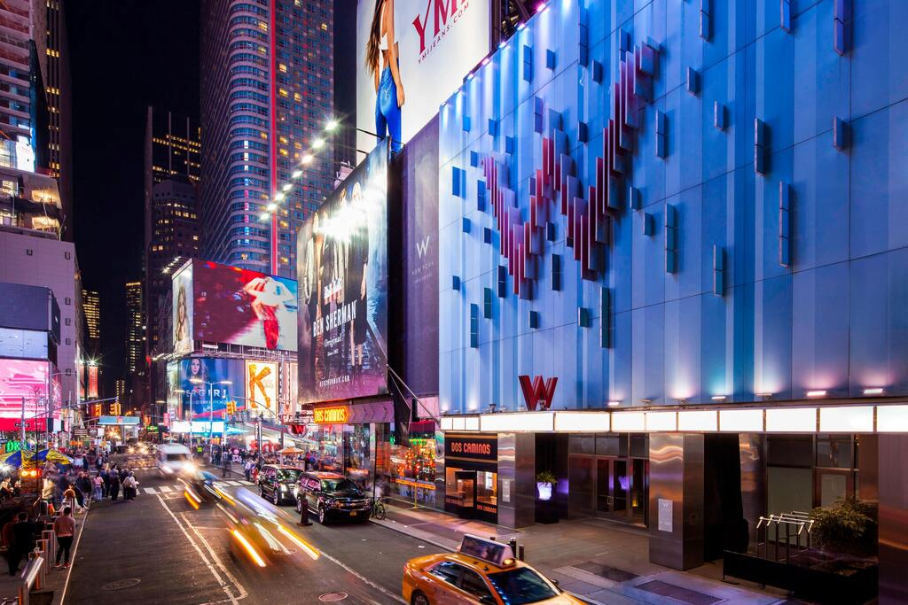

## unseen
The main idea finding the flag is using LSB bit and steghide tools.

#### Step-1:
After I downloaded `nyc.png` & `morse.wav`, I tried basic `binwalk` and `strings`, but obviously it didn't work.



#### Step-2:
I tried to decode `morse.wav` online [here](https://morsecode.world/international/decoder/audio-decoder-adaptive.html).


#### Step-3:

This message gave me idea that I have to search further in image only. Using the LSB hint from the description, I found the string `42845193` at 1-bit LSB.

#### Step-4:
Using Steghide tool, I tried to extract data from the `morse.wav` by command `steghide extract -sf morse.wav`
Passphrase was `42845193`

It gave me this output:

```
wrote extracted data to "flag.txt".
```
#### Step-5:
Something to work on. So when I opened `flag.txt`. It was blank with space, tabs and newline. So I tried to decode that using Whitespace Decoder at : https://vii5ard.github.io/whitespace/


Voila! I had the flag there.

#### Step-6:
Finally the flag becomes:
`csictf{7h47_15_h0w_y0u_c4n_83c0m3_1nv151813}`