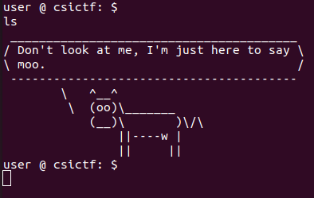
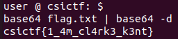

## AKA
The main idea finding the flag is using `base64` command.

#### Step-1:
When we run `nc chall.csivit.com 30611`,  we are pwned into a shell. I tried some basic commands like
`ls` to find flag, but it is blocked.

#### Step-2:
So I tried `base64 flag.txt | base64 -d`, and luckily worked.

Voila! We have our flag.

#### Step-2:
Finally the flag becomes:
`csictf{1_4m_cl4rk3_k3nt}`