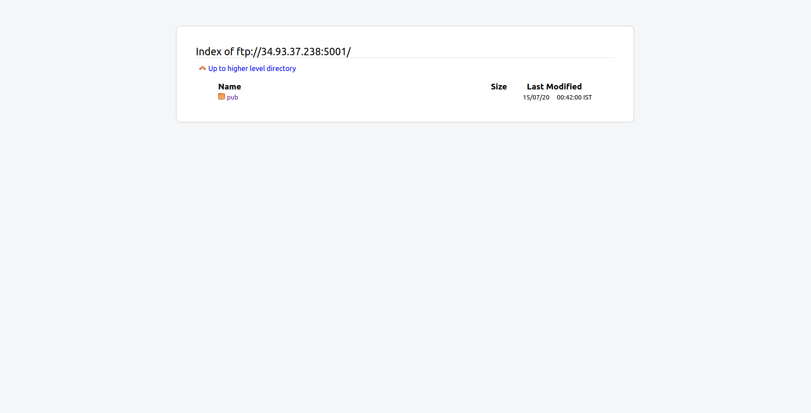
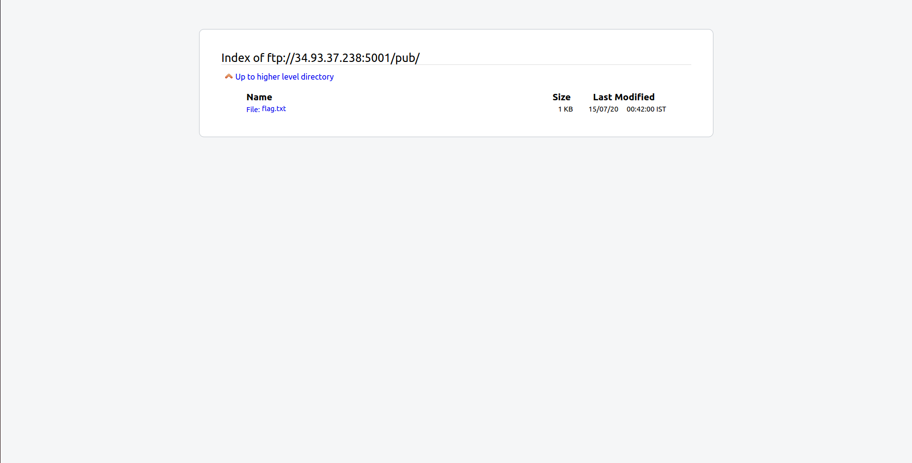

## HTB 0x1
The main idea finding the flag is anonymous FTP bypass.

#### Step-1:
The idea is similar to getting root access of a machine. So I started with basic `nmap 34.93.37.238` scan on the server. But unfortunately, not much. 

#### Step-2:
So I random access on FTP server through the given IP address by `ftp -p  34.93.37.238 5001`.

Voila! I was in!

No idea of credentials though.

#### Step-3:
So I just tried to access the FTP page through URL: ftp://34.93.37.238:5001/

It directly showed this webpage.

#### Step-4:

Next it was just navigating through to get the flag.

#### Step-5:
Finally the flag becomes:
`csictf{4n0nym0u5_ftp_l0g1n}`