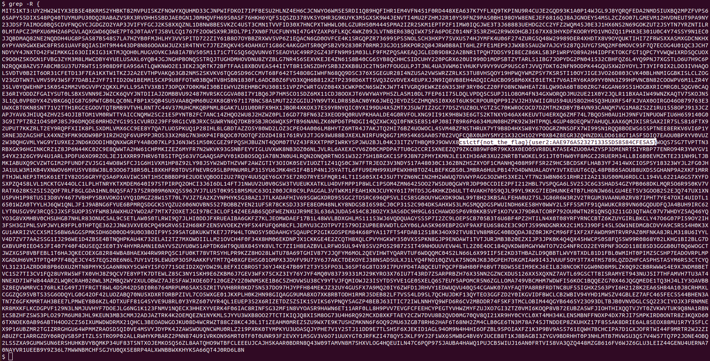
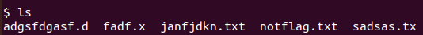
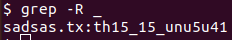

## find32
The main idea finding the flag is using basic Linux commands.

#### Step-1:
When we run `ssh user1@chall.csivit.com -p 30630` and password as `find32`, we are pwned into a shell.

A simple `ls` command gives us many files which are random.

```
02KG7GI3  66SLWGGM  AZF6YNNW  HI1HXC9E	LP29J6MU  PM7NRHP0  VCSYBT6V
02M95EZJ  6IGISUOK  BAL0FX4Y  HJ7SLXWJ	LQWDHMT1  PMWQY71J  VFFKFKFP
041Q5VQ6  6IS45I48  BDMSPZFU  HKX85U5A	LR9H9RJ4  PN7VNWMY  VL8QUY6U
0K8HTQUI  6JFHFM48  BDYM2DL3  HL9OQ59W	LS1E6E8N  PRIT98R2  VOAZ2FLA
0L51GUQ6  6JJ8M6EQ  BH13PMF2  HTFON23U	M0ODDGTQ  PUKTT71A  VQHX8Y2S
0POE7NLS  6KPKMW7F  BP1QOD2S  HW9ZGUI0	M2D9A9GW  PX7XX8MV  VS2QLP5T
0XC8TJL6  6NZ8YTHN  BRKQC7KI  HWR8ILW8	M2W3FH21  PXR9X9H1  VS5RKUTC
10KS7XSL  6O893R7P  BT4Q0KSC  I0GJ1ZT2	M40WA6L0  Q3VV2P04  VU7UXE91
17HSIYXQ  6TQAQ9JL  BUIYBJW6  I0HK3F0Q	M45WG887  QBZ2NYYY  VUU3IP28
1DB6A3RZ  6Y96J42D  BW90182E  I3QH2SGS	M4PSP87C  QDDZKQBI  VWXNPY8W
1EBY9SNN  71PCO4II  BZE1NCWY  I7BE5SNQ	M50MK22L  QDZM9GU3  VYXH92ZI
1TE2UPR9  74EIPRM5  C1KDRW2G  I7BYYSUH	M6MO9M1W  QON3WELD  W569XUGK
1VQPZIUO  784MLE5E  C5L2LOAA  IHGA1LHQ	M8XE7P73  QV763DK6  W56UYZUK
1W6RAWEU  79VJFIU5  C75ZYB8Q  INUIDPFZ	MAC4PGYS  QXKDIR8P  W7N3EQ8A
21X763CW  7EA2V52Y  C7LAWJCM  ISW6FLPB	MDZE1NQC  QYBFIDQA  W8XHJP69
24CHFLCM  7IKIFVQC  C9EN38OZ  IUKF08Y4	MIN0CJNB  QYKLAVOR  WFLCEXOU
24UQMOA7  7JKVQ1V4  CB7VL2AM  IW0M1T97	MITS1KT3  QZBKI0LI  WHYUOJS2
2FFS4207  7K2HS4Y8  CR8AY5W7  IXLBEBRX	MLNCZNJH  R3O1QJRE  WO7DKKIR
2L9WVOQA  7O0E74NI  CVDGAH14  IYLAWPCR	MLRX5NHC  R513RF7X  WQYZVZ02
2MMNROKS  7QQAKH41  CYNFLG1O  IYT9TNZ3	MT0ZF01M  R75LDKZA  WW5L7JNK
2X82259Q  7UB67288  D01U0OA5  J634H910	MVYJ08ZU  RHZ4QIGE  WXW4GEDU
31H6U39X  7UYWYDBZ  DC953402  J9K0N1G3	MWE4SJWL  RSA9B4XA  X1SVRUTM
32DJSRCD  80TD6MQ1  DHI6XKWG  JBNLA5LS	N56AGDMY  RXHHGT3D  X23268R9
36VMK9BG  82R7NE45  DQZAE7MY  JCUBGZ0L	N8O0W1UR  RYRXFTD0  X44EBTIV
3B2F652L  84XR0NUK  DVRULQ4L  JD8K3921	N9ZX32OP  S3CQF12S  X4O9C3E9
3C71HLAH  89JKXHMI  E2DCKTAW  JDVT05Q1	NDR9IE07  S50ORS2M  X70F203P
3CWSG1VM  8AYM8OQ9  E2WWNK1U  JL8V5YGI	NGT5TVLI  S9796BM8  XA6HG1VW
3E7ZTAVL  8BHHDOCA  E3VMO1UV  JM035B27	NJJ4FIMD  SA13FEFE  XAGJI6C3
3FSO4YLX  8DCJBGN8  EBGAB2T7  JMXU733Y	NMMNMEDT  SGCS15D7  XBJ59Z81
3MPI6ZGG  8O23G30S  EDL1IX5Y  JNTGVLSL	NNGY3F51  SSNMEO7G  XESS84R7
3NI0KD8T  8Q8IDTC7  EJKM4P8J  JQJIA3QC	NQ3BFZKH  ST1FTYFZ  XM6M6XV3
3O7SZPP5  8SQP2JFV  EMAPY1SV  JSWT0A61	NTIJFZDS  STYTHKQE  XVXM67UN
3SF18NHO  90ORMN66  EMOTUDML  JW5DHBI2	NWAG08DF  SWD8ZKVQ  XZ5KZZPR
3WJNQHOI  931P2T2C  EPIGX1NO  JYP14B13	NXH2E4FB  SXRZ25DU  Y0WAA0QK
3Y6ULSYJ  95NBR36B  EUXTE3IX  K5HIYP7U	O08K936H  T0ST0WFT  Y2F5YYPT
40HE4X61  99KWRIDG  EXVHNHYF  K7H88QI2	O20W8JF2  T5D06H6O  Y41T1L0P
41W0HO2L  9EO10QRH  EYN874N3  K80WPMFB	O8C1K8CS  THW3C7CC  YB6CGUEN
4DXWEUAK  9KHTQSOG  F4K726ZE  K8670JAD	OA9OWQNN  TIE17JV7  YGAD81HL
4E5VZT6C  9KQEWTD4  F5FFWSP3  KDT49C2O	OAVKKSIU  TNGM39LQ  YI5ISTTI
4FMGJMPX  9KVDBM8O  F9T58X71  KJ26BDR0	OB0TZRYT  TNNLXAMK  YI9VPU71
4LMTFZCM  9LNZ0ETP  FH0FGQU9  KOIIQDDB	OHGWT0IT  TOD5ZOWV  YJ4H3LH9
4LYTO0ZG  9MP89P4E  FI9WZ1NI  KQFVQJ3J	OI290XGJ  TP72DLYC  YJPL7KY5
4NE1DLAV  9QNUXM4L  FJATAT6I  KRNKFQTK	OJTT5YOZ  TQYI4JH2  YLTYQ7PT
4O0KVR5P  9R6FWLZQ  FMZXZWMD  KRTDDSYK	OLHQ2XMI  TY2N5W2V  YZOFT123
4UOCNFI8  9SMDHC89  FOGK2TD9  KTE9QN31	OM4BZRJ6  TZ4TM4KC  Z8TPG2SQ
4VTQDZXG  9TM8NR4D  FPLW13DY  KUNZ9OP2	OO08I86R  U1HE6HJU  ZE0LYP1J
526KAB1Q  9UGJX4Z2  FUF4GEJ2  L25P2X6S	OPTKWTEN  U1Z144SU  ZIIFJZRE
5669QKVZ  9X0BSFFX  G18VV3XH  L6RJI5MH	OTQLM9FR  U4CT6S3M  ZKOYMDBL
5714I59N  9YN7B5TM  G20VWPOJ  L97LN1SA	OVB0C2DD  U9KXZUZT  ZOM1L6RA
5D8MSKXV  A202VRDJ  G4DRQMVC  L9HIBPO9	OXNCWNKP  UFF3VJES  ZUIZ3BRS
5DNAUH8Z  A8DWWULS  GBIA0FJJ  L9NCYUOA	P7U25CJI  UFRWO7LV  ZXWG1CJB
5DY1KZDZ  A9ARPBTE  GCCH7GUL  LA28D194	P7ZSATBS  UI3CYXEH  ZYSF9F0A
5E0OD9MJ  AK1L1RB0  GGK14ZEP  LB4B6X6P	P8H2QJZE  UK268DBR
5FOOLY10  AK6PZX3H  GN72VYNY  LDMDGEL4	PBMIEOJ1  UMVACDSG
5HQTP051  AL2HOE1I  GVAUVIPU  LF6NHZRK	PF2KOY3A  UOKCOUPN
5OWRFEZT  ATP6Z1LV  GVTHMJMC  LIVI4VP2	PJU5YNCE  USP8NX9I
5S7QF3H6  AYHI7FZG  H782K0GF  LKLQLQ8B	PKEIXGTL  UTNI6PSD
5ZCQW7TK  AZBQ6DI4  H7PWE6D1  LKUM0ZLZ	PLE8FFL4  V8A4PPEG
```

#### Step-2:
So I tried `grep -R {`, to search for possible flags throughout.



#### Step-3:
Well, I was greeted with a false flag & new user credentials, so I ssh'ed with that next time.

`ssh user2@chall.csivit.com -p 30630` and password as `AAE976A5232713355D58584CFE5A5`. This weird ass number beside User2 name.

Luckily I was in.

#### Step-4:

This time I tried `ls` and actually find very less files. 



#### Step-5:

So I immediately tried `grep -R _` and got it.



#### Step-3:
Finally the flag becomes:
`csictf{th15_15_unu5u41}`