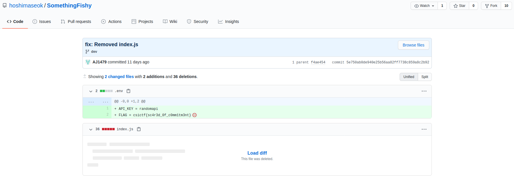

## Commitment
The main idea finding the flag is just basic Github commit search.

#### Step-1:
When I searched for `hoshimaseok` alias, I got a Reddit and a GitHub profile. Nothing interesting in Reddit profile, so I went directly for Github profile and entered the repo: [SomethingFishy](https://github.com/hoshimaseok/SomethingFishy)

#### Step-2:
However, I found nothing there, but in the `dev` branch, I got many [commits](https://github.com/hoshimaseok/SomethingFishy/commits/dev). So, there I searched for all commits and luckily I got the flag [here](https://github.com/hoshimaseok/SomethingFishy/commit/5e750ab0de940e25b56aa82ff7738c859a8c2b92).

#### Step-3:
Finally the flag becomes:
`csictf{sc4r3d_0f_c0mm1tm3nt}`

##### Note: This might be easy if we cloned the repo and search in .git/logs by Regex. Haven't given a try though xP. Just a thought.