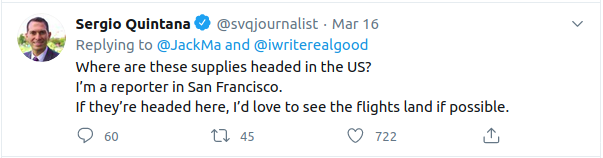

## Flying Places
The main idea finding the flag is just basic Internet Search.

#### Step-1:
After I downloaded `Flight.jpg`, I tried basic `strings`, `exiftool`, `binwalk`, but couldn't find any info.

#### Step-2:
After that, I directly searched it on Google Images and got a [Twitter](https://twitter.com/JackMa/status/1239388330405449728) thread, I tried to search for the reporter.

#### Step-3:
I got the destination in the comments.

Voila! I got the flag in comments!

#### Step-4:
Finally the flag becomes:
`csictf{san_francisco}`