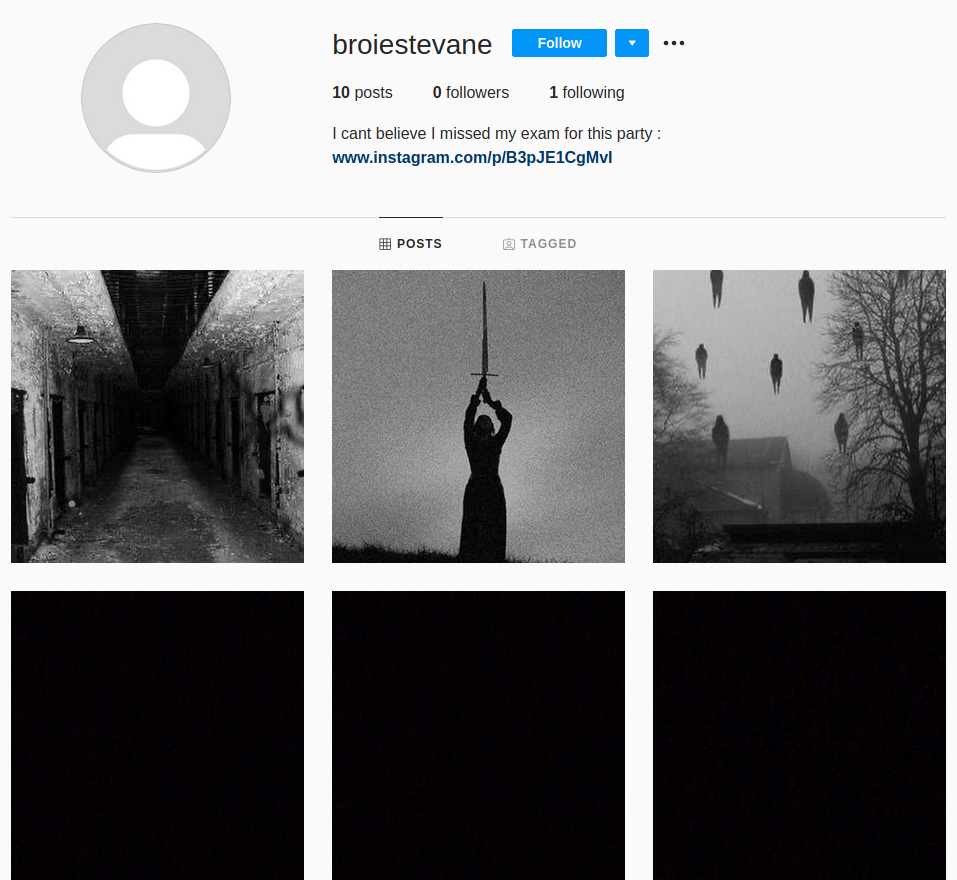
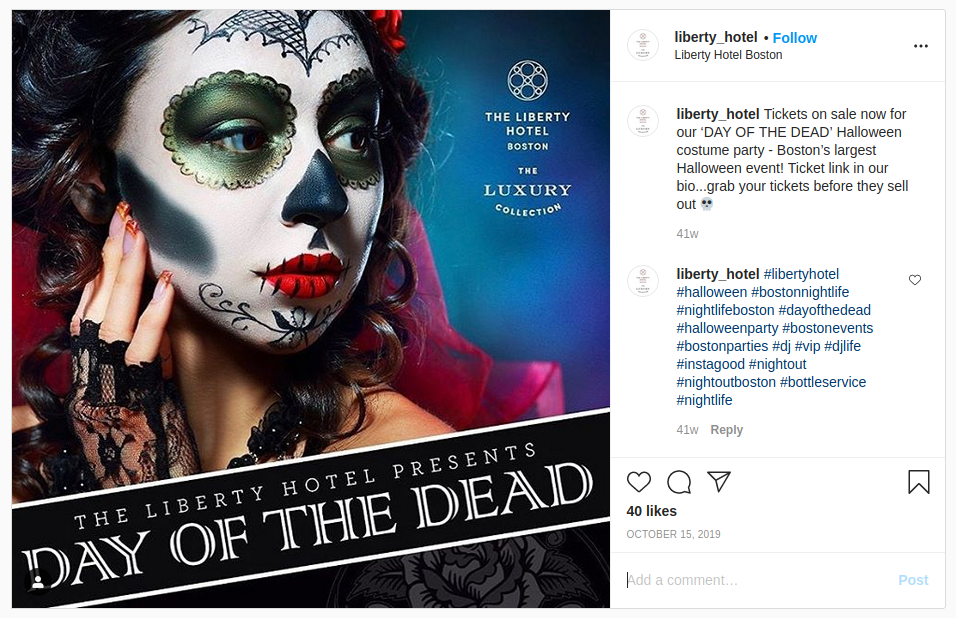

## LO SCAMPO
The main idea finding the flag is just basic Internet Search.

#### Step-1:
After I read the content, I searched for `Broiestevane` alias on Instagram.

`
'Malcolm X took Broiestevane to a Day of the Dead themed party but she never returned. Her only friends, Mr Bean and the Pink Panther realised that she was missing when she didn't show up for an exam. Broiestevane liked posting pictures, where was the party held?
`

#### Step-2:
I got a profile on [Instagram Profile](https://www.instagram.com/broiestevane/)

#### Step-3:
There I got the link to the post: https://www.instagram.com/p/B3pJE1CgMvI/

I got the flag there in the location of the post!

#### Step-4:
Finally the flag becomes:
`csictf{liberty_hotel_boston}`