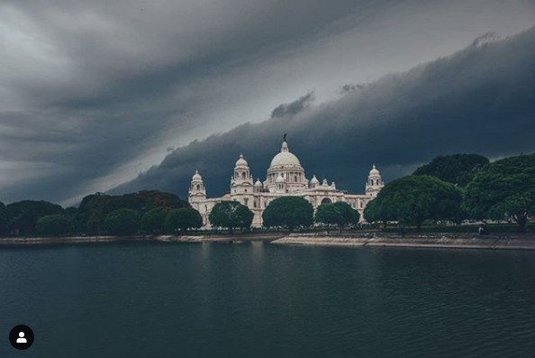
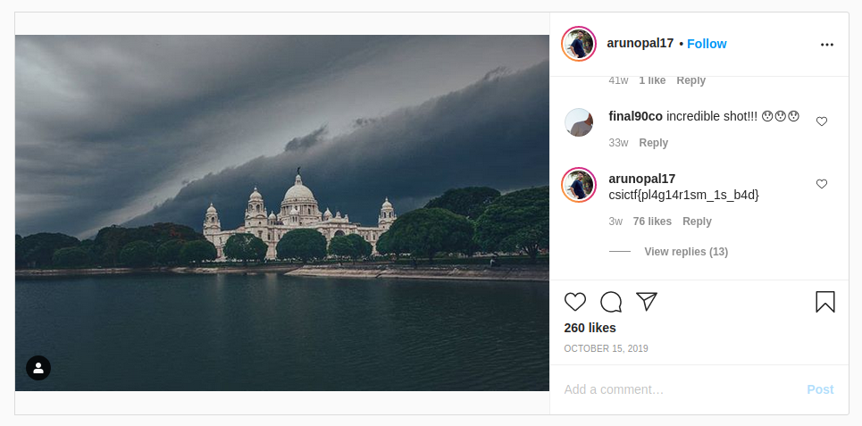

## Pirates of the Memorial
The main idea finding the flag is just basic Internet Search.

#### Step-1:
After I downloaded `storm.jpeg`, I tried basic `strings`, `exiftool`, `binwalk`, but couldn't find any info.

#### Step-2:
After that, I directly searched it on Google Images and got a [Twitter](https://twitter.com/rishibagree/status/1016932954143158274) thread, where the original photographer was mentioned subtly.

#### Step-3:
I searched for `Arunopal Banerjee` on Google and searched for top links and in his [Instagram Profile](https://www.instagram.com/arunopal17/), I found our `storm.jpeg`.

[Post](https://www.instagram.com/p/B3oKrLQgpko/):

Voila! I got the flag in comments!

#### Step-4:
Finally the flag becomes:
`csictf{m1ch34l_sc0fi3ld_fr0m_pr1s0n_br34k}`
