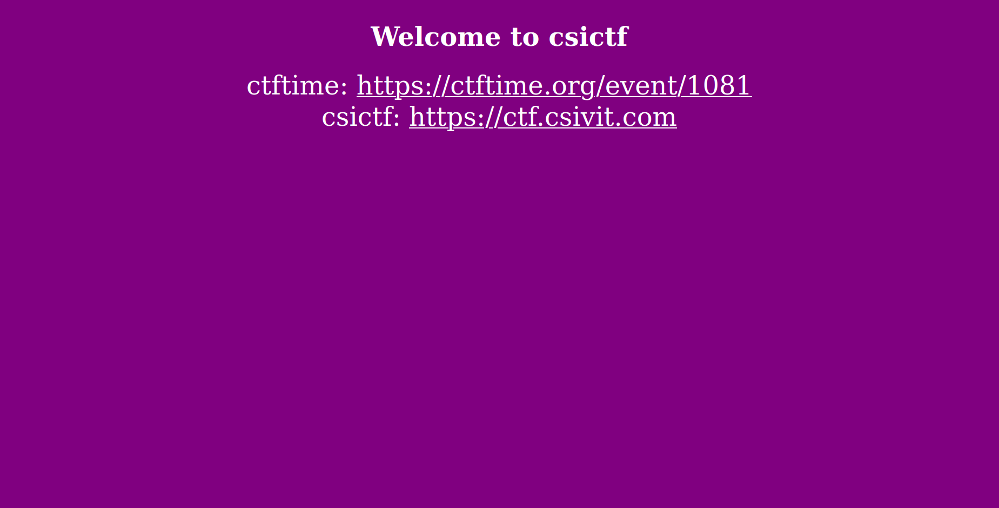
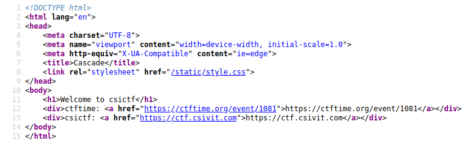
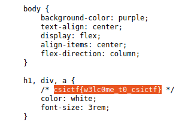

## Cascade
The main idea finding the flag is just viewing the page source.

#### Step-1:
After I visited the URL: http://chall.csivit.com:30203, this web page was shown:

#### Step-2:

I tried all `/robots.txt`, `/flag.txt` or any access to tiny server by `//`. Also by visiting both given links, didn't give any flags.

#### Step-3:
Now, I searched for page source, and got this web page.

I explored for `/static/style.css`.

#### Step-4:

Voila! I got the flag.

#### Step-5:
Finally the flag becomes:
`csictf{w3lc0me_t0_csictf}`