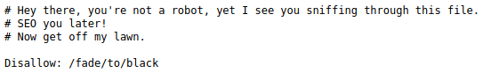

## Mr Rami
The main idea finding the flag is accessing dormant sub domains of the site.

#### Step-1:
After I visited the URL: [http://chall.csivit.com:30231](http://chall.csivit.com:30231), this web page was shown:

#### Step-2:

I tried http://chall.csivit.com:30231/robots.txt and I got this:

#### Step-3:
There we got that `Disallow: /fade/to/black`, so I explored that URL: 
http://chall.csivit.com:30231/fade/to/black

#### Step-4:
Voila! I got the flag there.

#### Step-5:
Finally the flag becomes:
`csictf{br0b0t_1s_pr3tty_c00l_1_th1nk}`
