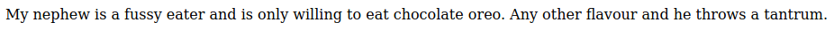
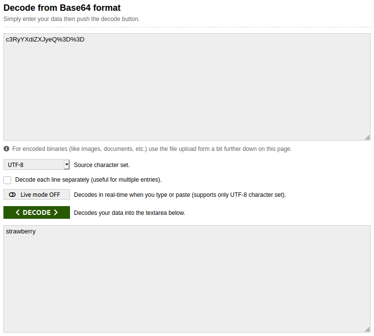
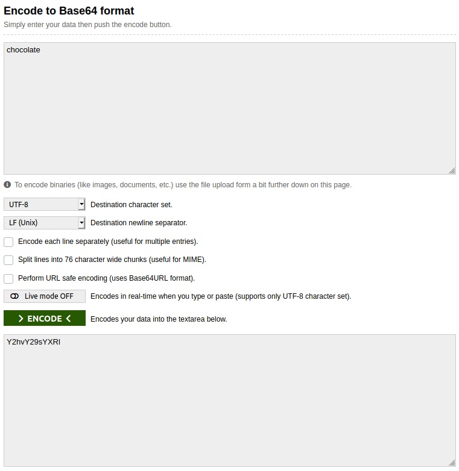

## Oreo
The main idea finding the flag is just tweaking the cookies.

#### Step-1:
After I visited the URL: http://chall.csivit.com:30243/, this web page was shown:

#### Step-2:

I tried inspecting the element, but it wasn't helpful. So I checked the cookie and got a cookie `flavour` with value `c3RyYXdiZXJyeQ%3D%3D`.

#### Step-3:
It was simple Base64 and I decoded it to get `strawberry`.

#### Step-4:
So I got to change the flavor to chocolate as in description. So I encoded `chocolate` accordingly, to get:

#### Step-5:
I loaded that base64 encoding `Y2hvY29sYXRl` as a cookie and refreshed the page to get the flag.

#### Step-6:
Finally the flag becomes:
`csictf{1ick_twi5t_dunk}`